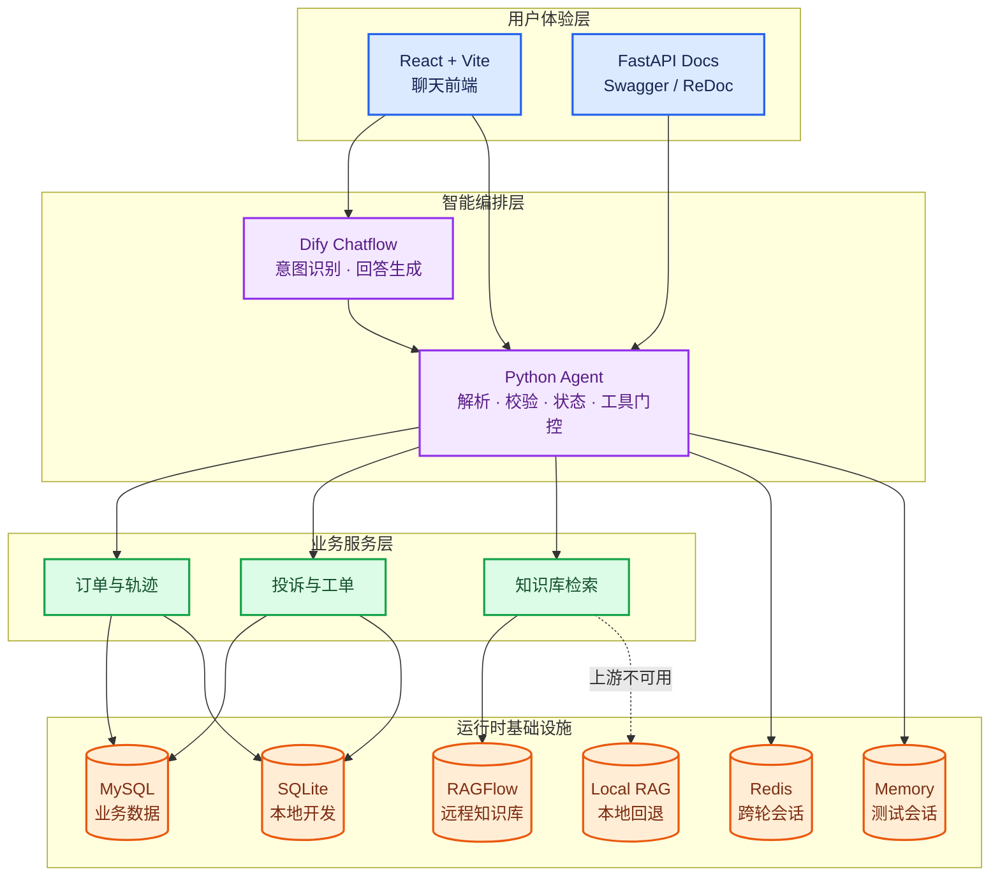
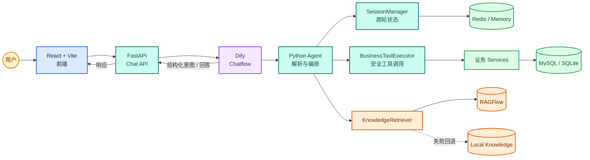

<div align="center">

# FreightOS

### 面向物流场景的 AI 智能客服与业务编排系统

基于 Dify + Python Agent + FastAPI 构建，支持物流意图识别、多轮会话、
订单查询、工单处理、知识库检索与安全的工具调用。

<p>
  <a href="https://github.com/diguy/FreightOS">
    
  </a>
  <a href="https://www.python.org/">
    
  </a>
  <a href="https://fastapi.tiangolo.com/">
    
  </a>
  <a href="https://react.dev/">
    
  </a>
  <a href="https://redis.io/">
    
  </a>
  <a href="https://www.mysql.com/">
    
  </a>
</p>

<p>
  <a href="#核心能力">核心能力</a> ·
  <a href="#系统架构">系统架构</a> ·
  <a href="#快速开始">快速开始</a> ·
  <a href="#项目结构">项目结构</a> ·
  <a href="#接口概览">接口概览</a> ·
  <a href="#测试与验证">测试与验证</a>
</p>

</div>

---

## 🧭 项目简介

FreightOS 是一个面向物流客服业务的后端实验与 MVP 系统。它把大模型的自然语言理解
与 Python 后端的业务约束分开：

| 层级 | 主要职责 |
| --- | --- |
| **Dify** | 当前轮意图识别、实体抽取、流程编排和客户可见回答 |
| **Python Agent** | JSON 契约校验、跨轮状态、槽位合并、确认门控和安全兜底 |
| **业务 Service** | 订单、轨迹、用户和工单等业务事实 |
| **MySQL / SQLite** | 业务数据持久化；本地开发可使用 SQLite |
| **Redis / Memory** | 跨轮会话状态；本地测试可使用内存实现 |
| **RAGFlow / Local RAG** | 物流规则知识检索和来源返回 |

核心原则是：**模型负责理解，后端负责事实、状态和安全。**

## ✨ 核心能力

- 💬 **物流意图识别** - 查询物流、修改地址、投诉、人工转接、工单和知识问答等场景。
- 🎙️ **多轮会话状态** - 通过 `SessionState` 保存有效意图、实体、缺失槽位和确认状态。
- 🌈 **安全工具调用** - 只有在契约校验、用户权限、业务规则和确认门控通过后才执行工具。
- 📦 **订单与轨迹查询** - 业务事实由 Service / Repository 从 MySQL 或 SQLite 获取。
- 🛠️ **工单处理** - 支持投诉、人工服务和地址变更等业务流程。
- 📚 **知识库检索** - 优先使用 RAGFlow；上游不可用时回退到本地知识库。
- 🔌 **可替换运行时** - 业务数据库和会话存储均可通过环境变量切换。
- 📊 **前后端分离** - React/Vite 前端通过 FastAPI 接口访问后端，不直接接触数据库和密钥。

## 🧩 技术栈总览



| 颜色 | 模块 | 作用 |
| --- | --- | --- |
| <span style="color:#2563eb">🔵 蓝色</span> | 用户体验层 | React 前端和 FastAPI 文档 |
| <span style="color:#9333ea">🟣 紫色</span> | 智能编排层 | Dify 与 Python Agent |
| <span style="color:#16a34a">🟢 绿色</span> | 业务服务层 | 订单、工单和知识库服务 |
| <span style="color:#ea580c">🟠 橙色</span> | 运行时基础设施 | MySQL、Redis、SQLite、RAGFlow |

## 🏗️ 系统架构



### 一次请求如何流转

1. 前端将用户消息和 `session_id` 发送到 FastAPI。
2. Dify 根据当前消息和有效会话上下文输出结构化结果。
3. Python Agent 解析并校验 `IntentResult`，合并跨轮槽位。
4. 只有满足权限、参数完整和确认条件时，业务工具才会被调用。
5. 业务 Service 从 MySQL/SQLite 获取事实，或从 RAGFlow/本地知识库检索规则。
6. 后端保存新的 `SessionState`，再返回结构化响应和客户可见回答。

## 📁 项目结构

```text
FreightOS/
├── app/                    # FastAPI 后端、Agent、Service、Repository、RAG
│   ├── agent/              # Dify 适配、意图解析、会话和工具编排
│   ├── routes/             # HTTP 路由
│   ├── services/           # 订单、轨迹、工单等业务服务
│   ├── repositories/       # 数据访问层
│   ├── rag/                # RAGFlow 与本地知识库适配
│   └── data/               # 本地开发数据目录
├── frontend/               # React + Vite 前端
├── scripts/                # 运维、知识库构建和评测脚本
├── tests/                  # 项目自动化测试
├── docs/                   # 契约、运维、架构和交付文档
├── pyproject.toml          # Poetry 项目与 pytest 配置
└── poetry.lock             # Python 依赖锁定文件
```

## 🚀 快速开始

### 1. 准备环境

- Python `3.13+`
- Poetry
- Node.js 和 npm
- MySQL 与 Redis（生产/集成模式）
- Dify（需要真实模型链路时）
- RAGFlow（需要远程知识库检索时）

### 2. 安装依赖

```powershell
poetry install
cd frontend
npm install
cd ..
```

### 3. 配置环境变量

本地配置文件不会提交到 Git。可参考：

- [环境变量模板](docs/ops/.env.example)
- [生产运行说明](docs/production-operations.md)

快速本地测试可以使用：

```powershell
$env:APP_DATABASE = "sqlite"
$env:SESSION_STORE = "memory"
```

生产或集成环境通常使用：

```powershell
$env:APP_DATABASE = "mysql"
$env:SESSION_STORE = "redis"
```

请根据实际环境配置 `APP_MYSQL_*`、`REDIS_URL`、`DIFY_*` 和 `RAGFLOW_*`，
不要把 API Key、密码或真实业务数据写入 README、代码或 Git。

### 4. 启动后端

```powershell
poetry run uvicorn app.main:app --reload --port 8000
```

后端地址：<http://localhost:8000>

### 5. 启动前端

```powershell
cd frontend
npm run dev
```

前端地址通常为：<http://localhost:5173>

## 🔗 接口概览

| 接口 | 用途 |
| --- | --- |
| `GET /health` | 检查后端进程是否存活 |
| `GET /health/dependencies` | 检查 MySQL、Redis 等依赖状态 |
| `POST /api/v1/chat` | 用户聊天入口 |
| `POST /api/v1/agent/turn` | Dify 调用的 Agent 编排入口 |
| `/api/v1/orders/*` | 订单和物流轨迹相关接口 |
| `/api/v1/tickets/*` | 投诉、人工和工单相关接口 |
| `/api/v1/knowledge/*` | 本地或 RAGFlow 知识库接口 |

启动后可访问 FastAPI 文档：

- Swagger UI：<http://localhost:8000/docs>
- ReDoc：<http://localhost:8000/redoc>

## 🧪 测试与验证

运行项目自身测试：

```powershell
$env:APP_DATABASE = "sqlite"
$env:SESSION_STORE = "memory"
poetry run pytest tests -q -m "not integration"
```

构建前端：

```powershell
cd frontend
npm run build
```

Redis、MySQL、Dify 和 RAGFlow 的真实集成测试需要对应服务已经启动；
相关手工验收步骤见 [生产运行说明](docs/production-operations.md)、
[Dify 链路测试](docs/live-dify-chain-test.md) 和 [RAGFlow 配置](docs/ragflow-setup.md)。

## 📚 文档导航

- [架构决策记录](docs/project/ARCD.md)
- [产品需求文档](docs/project/prd.md)
- [项目说明与交接信息](docs/project/project.md)
- [开发工作流](docs/project/WORKFLOW.md)
- [意图识别契约](docs/intent-contract.md)
- [会话状态契约](docs/session-contract.md)
- [MCP 服务契约](docs/mcp-server-contract.md)
- [知识库验证](docs/stage2-knowledge-validation.md)
- [历史交付物与 DSL](docs/artifacts/)

## 🚧 当前状态

当前项目已形成可运行的 Dify → FastAPI → Python Agent → 业务 Service 闭环，
并具备 MySQL/SQLite、Redis/Memory、RAGFlow/本地知识库等运行时切换能力。

后续重点包括：扩大 Dify 真实回归覆盖、完善外部服务重试与熔断观测，
以及继续补齐生产环境的告警和运维自动化。

## 🤝 贡献

欢迎通过 Issue 或 Pull Request 反馈问题。提交代码前请先阅读
[开发工作流](docs/project/WORKFLOW.md) 和仓库根目录的 [AGENTS.md](AGENTS.md)。

## 📄 License

本项目当前用于学习、实验和物流客服 MVP 验证。正式发布前请补充明确的开源许可证。
